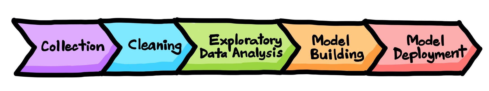

# Data_Science_Learning
Repository for documentation related and created in learning Python and Data Science/Data Analytics.

This repository is a practical, beginner-friendly introduction to data analysis covering the basics of Python, Numpy, Pandas, Data Visualization and Exploratory Data Analysis.

And where:
- We will see hands-on tutorials focused on coding
- Practice coding with Jupyter notebooks in the cloud
- Build a real-world end-to-end course projects

Folders:
* [DS_em_Producao](https://github.com/Lulasales/Data_Science_Learning/tree/main/DS_em_Producao)
   * Data Science in Production Course Repository
* [Python_Impressionador](https://github.com/Lulasales/Data_Science_Learning/tree/main/Python_Impressionador)
   * Python Impressionador Course Repository
* [Python_do_Zero_ao_DS](https://github.com/Lulasales/Data_Science_Learning/tree/main/Python_do_Zero_ao_DS)
   * Python do Zero ao DS Course repository
* [images](https://github.com/Lulasales/Data_Science_Learning/tree/main/images)
   * Repository of images used in this repository
   
