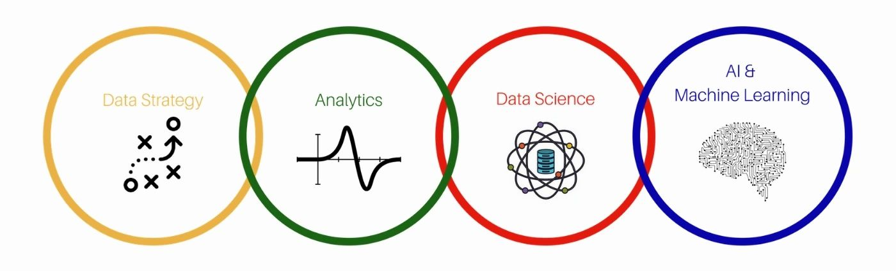

# Data_Science_Learning
Repository for documentation related and created in learning Python and Data Science/Data Analytics.

This repository is a practical, beginner-friendly introduction to data analysis covering the basics of Python, Numpy, Pandas, Data Visualization and Exploratory Data Analysis.

And where:
- We will see hands-on tutorials focused on coding
- Practice coding with Jupyter notebooks in the cloud
- Build a real-world end-to-end course projects
